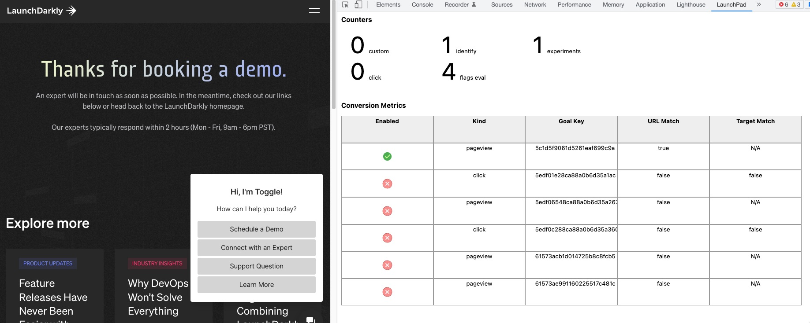
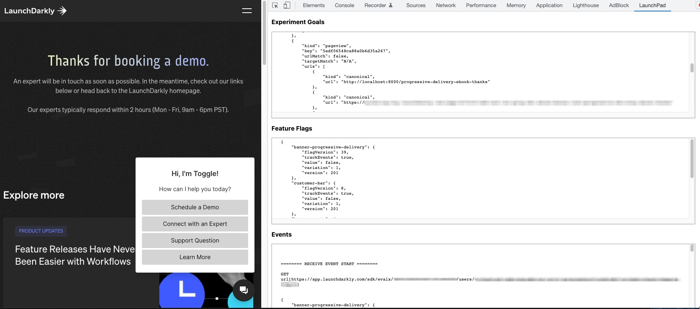

# LaunchDarkly Javascript SDK Event Viewer
Launchdarkly JS Client SDK event viewer Chrome extension
## Capabilities
1. Capture the following events
    *  flag evaluations
    *  identity events
    *  custom events
    *  click and pageview events
    *  stream updates
 2. Display and validate Conversion Metrics
    *  show conversion metrics that matches URL and element on the page using the CSS selector specified
3.  Log payload/details of the following SENT and RECEIVED events:
    *  flag evaluations
    *  identity events
    *  custom events
    *  click and pageview events
    *  stream updates
4. Display Feature flags loaded by the JS client SDK.
 
## Capture and validate Conversion Metrics

## Capture Goals, Feature Flags and Events

# Installation
1. Clone [this](https://github.com/tanben/ld-jssdk-event-viewer) repo and follow the instruction [here](https://developer.chrome.com/docs/extensions/mv3/getstarted/#unpacked) on loading an unpacked  Chrome extension.

2. Navigate to your page and [Open the Chrome dev-tools](https://launchdarkly.atlassian.net/wiki/spaces/~591637646/pages/edit-v2/2025359513#). 

3. Select **Launchpad** from the tab list.
4. Reload your page.

