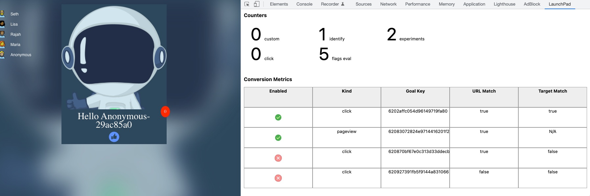

# ld-jssdk-event-viewer
Launchdarkly JS Client SDK event viewer Chrome extension

# Installation
1. Clone the repo and follow the instruction [here](https://developer.chrome.com/docs/extensions/mv3/getstarted/#unpacked) on loading an unpacked  Chrome extension.

2. Navigate to your page and [Open the Chrome dev-tools](https://launchdarkly.atlassian.net/wiki/spaces/~591637646/pages/edit-v2/2025359513#). 

3. Select Launchdpad from the tab list.
4. Reload your page.

# Dependencies
* [Ace Editor](https://ace.c9.io/) - packaged with the ACE library [here](https://github.com/ajaxorg/ace-builds/tree/master/src-min) in ./src-min. Copyright notice [here](https://github.com/ajaxorg/ace/blob/master/LICENSE)
