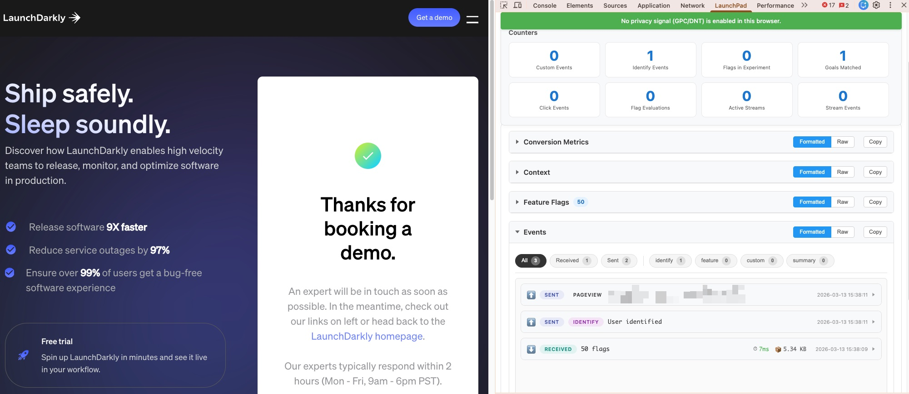

# LaunchDarkly JavaScript SDK Event Viewer

Capture, display, and debug LaunchDarkly JavaScript SDK events. Available as a **Chrome DevTools extension** and a **bookmarklet** that works in any browser.



## Features

- Flag evaluations, identify events, custom events, click/pageview events
- Stream (SSE) connection monitoring
- Conversion metric validation with URL and element matching
- Flags in experiments detection
- Raw/formatted views with event filtering and timeline
- Export captured data as JSON
- Copy to clipboard

## Usage

### Chrome Extension

Uses the Chrome DevTools Network API for full-fidelity request interception including HAR timing data.

1. Clone this repo
2. Go to `chrome://extensions/`, enable **Developer mode**
3. Click **Load unpacked**, select the repo root
4. Open DevTools → select the **LaunchPad** tab

### Bookmarklet

Runs on any page via a bookmark click. Intercepts LD SDK traffic by monkey-patching `fetch`, `XMLHttpRequest`, and `EventSource`. UI is isolated in a Shadow DOM.

**To set up GitHub Pages for your fork:**

1. Run `./build.sh` to generate `docs/dist/v1/`
2. Create a `gh-pages` branch: `git checkout -b gh-pages && git add docs/dist && git commit -m "Add dist" && git push -u origin gh-pages`
3. Go to **Settings → Pages → Source: "Deploy from a branch" → Branch: `gh-pages`, folder: `/docs` → Save**

Then visit your Pages site to drag the bookmarklet to your bookmarks bar, or create a bookmark with this URL:

```
javascript:void(function(){var s=document.createElement('script');s.src='https://YOUR_USER.github.io/YOUR_REPO/dist/v1/loader.js';(document.head||document.documentElement).appendChild(s)})()
```

### Script Tag

Drop this into any HTML page to load the viewer automatically:

```html
<script src="https://YOUR_USER.github.io/YOUR_REPO/dist/v1/loader.js"></script>
```

The bookmarklet patches `fetch`/`XHR`/`EventSource` for the current page session. Click it, then **reload the page** so the patches are in place before the SDK initializes. Click again to toggle visibility; navigate away to clear it.

The script tag approach doesn't need a reload — it loads with the page so patches are already in place.

To remove the viewer without navigating, run in the console:

```js
__ldEventViewerRemove()
```

## Local Development

```bash
# Build bookmarklet assets into docs/dist/v1/
./build.sh

# Serve locally and open the test page
npm run dev
# → http://localhost:8080/test.html
```

The test page provides buttons to simulate LD SDK traffic so you can verify the event viewer works.

## Self-Hosting / Versioning

Built assets go into `docs/dist/v1/` (generated by `build.sh`, not committed to main). To create a new version:

```bash
./build.sh v2
# Assets land in docs/dist/v2/
# Update your bookmarklet URL to point at v2
```

For GitHub Pages, the `gh-pages` branch holds the built `docs/dist/` directory. The main branch keeps only source files.

## Architecture

```
# Extension files (primary):
manifest.json, devtools.html, devtools.js, panel.html, panel.js,
mystyle.css

bookmarklet/
  loader.js            Entry point – loaded by bookmarklet URL or script tag
  interceptors.js      Monkey-patches fetch, XHR, EventSource
  panel-html.js        HTML template (injected into Shadow DOM)
  bookmarklet-init.js  Thin adapter: Shadow DOM, draggable, event bus wiring
  bookmarklet.css      Scoped styles for the overlay panel

docs/
  index.html           GitHub Pages landing page
  test.html            Local test page with mock LD traffic
```

The extension's `panel.js` is the primary codebase. It exposes a `window.LDPanel` API that the bookmarklet adapter (`bookmarklet-init.js`) uses at runtime. DOM queries go through a `_root` variable that defaults to `document` for the extension and is set to `shadowRoot` for the bookmarklet.

The bookmarklet uses a **Shadow DOM** to isolate styles from the host page. A lightweight event bus (`window.__ldEventBus`) connects the network interceptors to the UI. `build.sh` copies `panel.js` alongside the bookmarklet files into `docs/dist/v1/` for serving via GitHub Pages.

## Credits

Original extension by [Benedicto Tan](https://github.com/tanben). Bookmarklet adaptation adds in-page overlay support.
